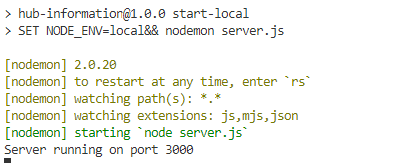
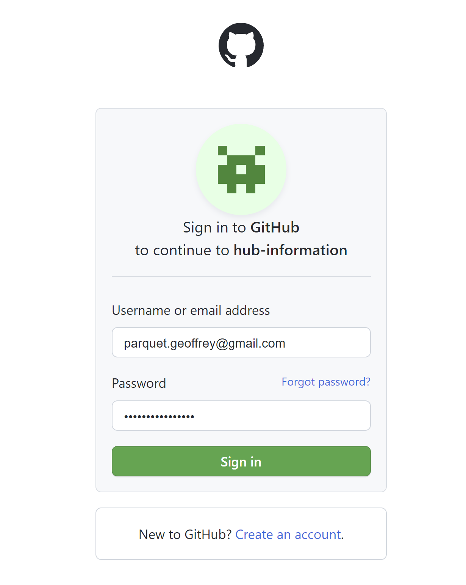

<style>img{width:  10%}</style>

<div  align="center"  style="font-size:50px; font-weight:bold;margin-bottom:100px;">

Hub-Information


</div>

## À propos du projet

Cette application fait partie du TP sur la présentation React. Cependant, elle peut être présenté à part si vous le souhaitez.

Elle a pour but de présenter les différentes fonctionnalités que proposée par ES6.

La finalité de cette dernière, permet de récupérer des informations (organisations, repositories, pull request), de votre compte GitHub et de l'es exposer sous forme d'API.

## Technologies utilisées

* [](https://www.w3schools.com/js/js_es6.asp)

* [](https://nodejs.org/en/)

* [](https://pnpm.io/fr/)

* [](https://www.docker.com/)

## Pour commencer

### Prerequisites

* npm

```sh

npm install npm@latest -g

```

### Installation

1. Cloner le repo

```sh

git clone https://github.com/your_username_/Project-Name.git

```

2. Installation des packages NPM

```sh

npm install

```

3. Créer un fichier `.env.local` à la racine du projet

4. Copier dans ce fichier les variables `CLIENT_ID` et `CLIENT_SECRET` se trouvant dans le fichier `.env`, puis renseignez les.

5. Lancer le projet

```sh

npm run start-local

```

<div  align="center">

</div>

### Utilisation

Pour le moment, vous pouvez voir dans le code que seulement deux apis sont disponibles (`Auth` et `CallBack`).

Vous pouvez tester l'authentification à GitHub en lançant la route d'authentification. (`http://localhost:3000/auth`)

Une fenêtre comme ci-dessous, vous sera affiché pour vous demander d'accepter que l'application soit liée à votre compte GitHub.

<div  align="center">

</div>

Une fois accepté l'application sera lié, vous retournerez sur l'application et un token doit-être affiché dans la fenêtre. À cette étape, le login ne nous sert pour le moment à rien, mais il sera utile pour la suite.

## Exercices

### Exercice 1

Créer une branche à part en local.

Reprendre la route `/callback` pour la rendre plus es6 friendly.

Vous pouvez voir un exemple de resultat en cliquant sur notre ami keepy [](https://github.com/Ekeep-IT/hub-information/tree/refactor/user-profile-api-exo1)

### Exercice 2

Créer une nouvelle branche à partir de l'exercice précédent.

Le but de cet exercice est de créer une api `/api/user/orgs` permettant de récupérer les organisations auxquelles l'utilisateur est affilié.

* L'api doit prendre en paramètre le token que vous aurez généré précédemment ex: `api/user/orgs?token={{token}}`

* Le **retour en cas de succès**, doit retourner un tableau d'objet **exemple ci-dessous** :

```

[

{

id: "1",

login: "orga1"

},

{

id: "1",

login: "orga2"

}

]

```

* Le **retour en cas d'erreur**, doit retourner l'erreur de l'api renvoyé par github.

Vous pouvez voir un exemple de resultat en cliquant sur notre ami keepy [](https://github.com/Ekeep-IT/hub-information/tree/feat/user-orga-exo2)

### Exercice 3

Créer une nouvelle branche à partir de l'exercice précédent.

Le but de cet exercice est de créer une api `/api/repos/orgs` permettant de récupérer les repos des organisations passé en paramètre.

* L'api doit prendre en paramètre le token que vous aurez généré précédemment **exemple**: `/api/repos/orgs?token={{token}}`

* L'api doit comprendre dans le body un tableau de repos (précédemment récupéré) **exemple ci-dessous**:

```

[

{

name: "repo1",

fullName: "orga1/repo1"

},

{

name: "repo2",

fullName: "orga1/repo2"

},

]

```

* Le **retour en cas de succès**, doit retourner tout l'objet de retour par l'API de GitHub

* Le **retour en cas d'erreur**, doit retourner l'erreur de l'api renvoyé par github.

Vous pouvez voir un exemple de resultat en cliquant sur notre ami keepy [](https://github.com/Ekeep-IT/hub-information/tree/feat/repos-orgs-exo3)

### Exercice 4

Créer une nouvelle branche à partir de l'exercice précédent.

Le but de cet exercice est de créer une api `/api/pull-request` permettant de récupérer les pulls request d'un repos contenu dans une organisation.

* L'api doit prendre en paramètre le token que vous aurez généré précédemment **exemple**: `/api/repos/orgs?token={{token}}`

* L'api doit comprendre dans le body un tableau d'organisation **exemple ci-dessous**:

```

[

"orga1",

"orga2"

]

```

* Le **retour en cas de succès**, doit retourner un tableau d'objet **exemple ci-dessous** :

```

[

{

name: "repo1",

fullName: "orga1/repo1"

},

{

name: "repo2",

fullName: "orga1/repo2"

},

]

```

* Le **retour en cas d'erreur**, doit retourner l'erreur de l'api renvoyé par github.

Vous pouvez voir un exemple de resultat en cliquant sur notre ami keepy [](https://github.com/Ekeep-IT/hub-information/tree/feat/pull-request-exo4)
